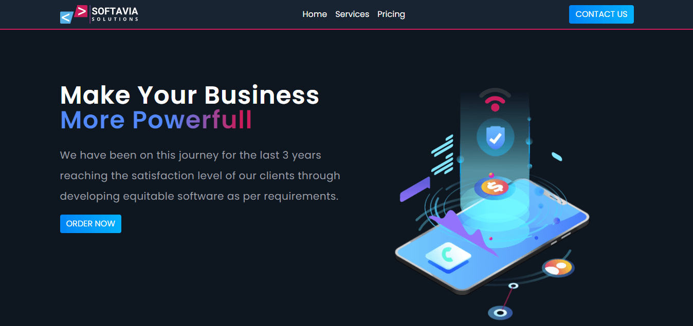

<p align="center">
    
</p>

<p align="center">
<a href="" target="blank">

</a>
<a href="https://github.com/shahriarshafin/softavia/blob/master/LICENSE" target="blank">

</a>
<a href="https://github.com/shahriarshafin/softavia/commits/master" target="blank">

</a>
<a href="https://twitter.com/intent/tweet?text=👋%20Check%20this%20amazing%20app!%20https://softavia.vercel.app/,%20created%20by%20@connectshafin">

</a>
</p>

<br/>

# Introducing `Softavia`

<p align="center">
    
</p>

`Softavia` is a demo project for showcasing a software company's website portfolio or products.


## Set up and run

1. Clone the repository

```bash
https://github.com/shahriarshafin/softavia.git
```

2. Change the working directory

```bash
cd softavia
```

3. Install dependencies

```bash
npm install # or, yarn install
```

4. Run the app in development mode

```bash
npm start # or, yarn start
```
That's All! Now open [localhost:3000](http://localhost:3000/) to see the app.

## Built With
- [React-Bootstrap](https://react-bootstrap.github.io/) : A popular frontend framework built-for React
- [Styled Components](https://styled-components.com/) : Visual primitives for the component age
- [React-Icons](https://react-icons.github.io/react-icons/) : One shop for all the icons
- [Lottie-Files](https://lottiefiles.com/) : JSON-based animation file format
- [Vercel](http://vercel.com/) : Best for Hosting a React app

## License
This project is licensed under the MIT License - see the [`LICENSE`](LICENSE) file for details.